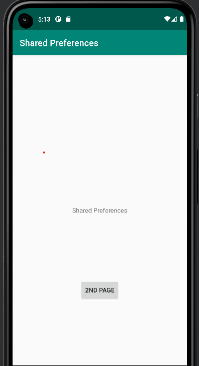

# Rapport - Preferences

För assignment 6 krävs det två olika aktiviteter. Den första aktiviteten agerar som en startsida som ska kunna ta användaren till den andra aktiviteten.
Arbetsgången påbörjades med att sätta ut Button i activity_main.xml som är en viktig komponent till bytandet av aktivitet. 

    <Button
        android:id="@+id/button_startActivity"
    ...
        android:text="2nd page"
    ...
        app:layout_constraintTop_toBottomOf="@+id/textViewSP" />

BILD!!!!!!!! 

För att implementera funktionen av att byta sidor användes nedanstående kod i MainActivity. 
Med denna kod berättar den vilket button element som ska kopplas till OnClickListener, och med intent
skiftar sidan från MainActivity till SecondActivity. 

        Button button = findViewById(R.id.button_startActivity);
        button.setOnClickListener(new View.OnClickListener() {
        @Override
        public void onClick(View view) {
        Intent intent = new Intent(MainActivity.this, SecondActivity.class);
        startActivity(intent);
        }
        });

Första sidan får ett utseende som illustreras med bilden nedan där button-elementet för sidobyte visas.

Enligt uppgiftsbeskrivningen krävdes en andra aktivitet där dess funktion är att användaren ska kunna skriva in en text som sedan sparas och blir shared preferences.
På grund av detta lades först en andra aktivitet till kallad SecondActivity som en java klass och i manifest filen. 

Den första kodsnutten är från manifest filen och visar den tillagda aktivitetn.

    <application
      ...
        <activity
            android:name=".SecondActivity"
            android:exported="false" />
        <activity
            android:name=".MainActivity"
            android:label="@string/app_name"
            ..
        </activity>
    </application>

I och med den nya aktiviteten skapades även en ny layout-fil för denna kallad secondactivity.xml, som hanterar diverse element och layouten för den andra
aktiviteten. I secondactivity.xml lades olika views till som olika TextViews, Buttons och EditText. Nedan finns beskrivning och kod för respektive View 
element som har större betydelse till projektet. 

Med EditText kan användaren skriva in text själv på sidan. 

    <EditText
    android:id="@+id/settingseditview"
    ...
    app:layout_constraintTop_toBottomOf="@+id/prefText" />

Button elementet uppfyller en funktion med hjälp av android:onClick="savePref" och android:text="@string/save" där dessa kodsnuttar
gör så att den inmatade strängen sparas vid klickning. 

    <Button
        android:id="@+id/prefButton"
       ..
        android:onClick="savePref"
        android:text="@string/save"
       ..
        app:layout_constraintTop_toBottomOf="@+id/settingseditview" />

Med denna TextView presenteras den inskrivna strängen från EditText. 

    <TextView
        android:id="@+id/prefText"
       ...
        app:layout_constraintTop_toTopOf="parent" />

Resterande element inom secondactivity.xml är en TextView som talar om att den andra aktiviteten visas, samt ännu en Button som
tar användaren tillbaka den första aktiviteten. 

    <TextView
    ...
    android:text="SecondActivity"
    ...
    android:layout_marginBottom="250dp"/>

    ...

    <Button
    android:id="@+id/backButton"
    ...
    android:text="Back"
    ...
    android:layout_marginRight="250dp"/>

Med möjlighet till sidobyte till den andra aktiviteten med widgets kan resultatet presenteras med nedanstående bild.

Kodsnutten nedan är tagen från SecondActivity. Med metoden savePref kan användarens inskrivna text sparas då denna kallas
efter att användaren klickar på button som hanterar lagringen. Metoden berättar att den data som sparas är kopplad
till den EditText med det specifika id settingseditview, vilket är den EditText som finns på andra aktiviteten. 
Med det mittersta stycket i kodsnutten får "MyAppPreferenceString" värdet på den inskrivna texten från EditText
, vilket innebär att strängen sparas. Det sista stycket med kod visar hädanefter den kod som har sparats. 

    public void savePref(View view){
    EditText newPrefText=new EditText(this);
    newPrefText=(EditText)findViewById(R.id.settingseditview);
    
            // Store the new preference
            myPreferenceEditor.putString("MyAppPreferenceString", newPrefText.getText().toString());
            myPreferenceEditor.apply();
    
            // Display the new preference
            TextView prefTextRef=new TextView(this);
            prefTextRef=(TextView)findViewById(R.id.prefText);
            prefTextRef.setText(myPreferenceRef.getString("MyAppPreferenceString", "No preference found."));
    
    ...
        }
    

Med en övergripande beskrivning säger denna kod att en shared preference hämtas sedan kallar den på edit metoden som hanterar eventuell ändring av
det användaren skriver in (shared preferences). 

    protected void onCreate(Bundle savedInstanceState) {
    ...
          
            myPreferenceRef = getSharedPreferences("MyPreferenceName", MODE_PRIVATE);
            myPreferenceEditor = myPreferenceRef.edit();

           
    ...

Det sista kodexemplet som refererar till viktiga komponenter i skapandet av appen finns i
MainActivity klassen. Även här hämtas den text som har skrivits in av användaren från EditView elementet i den andra aktiviteten.
Därefter presenteras denna i ett TextView element med id prefText. Detta slutför då det krav som beskrev
att användaren ska kunna skriva in valfri text i den andra aktiviteten som sedan visas i den första.

    @Override
    protected void onCreate(Bundle savedInstanceState) {
    ...

            myPreferenceRef = getSharedPreferences("MyPreferenceName", MODE_PRIVATE);
            myPreferenceEditor = myPreferenceRef.edit();

            TextView prefTextRef = new TextView(this);
            prefTextRef = (TextView) findViewById(R.id.prefText);
            prefTextRef.setText(myPreferenceRef.getString("MyAppPreferenceString", "No preference found."));
    ...

Exempel på användningen kan visas med följande bilder:

 

, , , 
,,  ](android.png)

